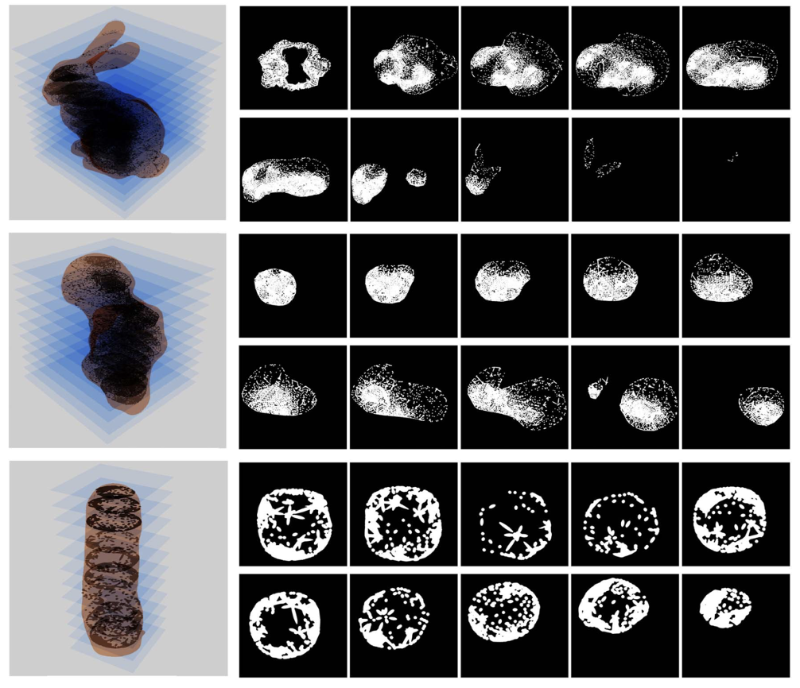
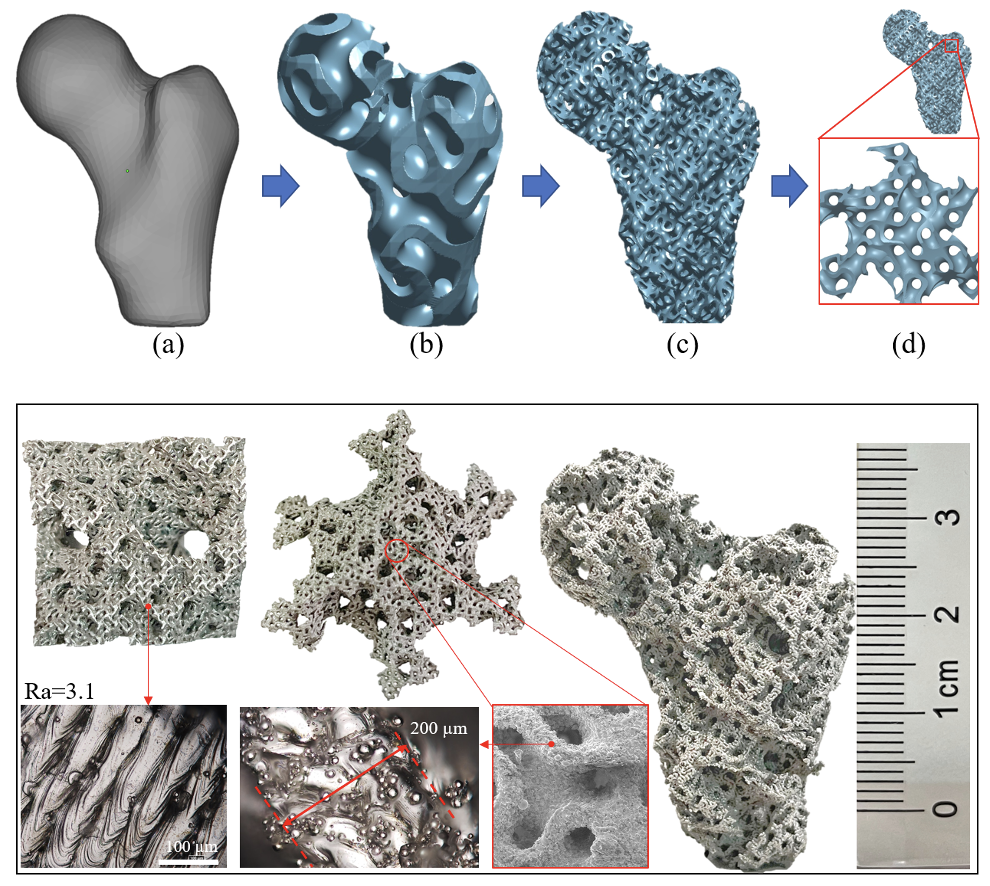

<!-- 


  
 -->

Implicit and Direct Slicer for Highly Complex Structures (ImplicitSlicer)
[Code](https://github.com/Qiang-Zou/ImplicitSlicer) [Paper](https://asmedigitalcollection.asme.org/computingengineering/article/21/6/061003/1100541/Memory-Efficient-Modeling-and-Slicing-of-Large)

 
A lightweight slicer for TPMS models (TPMSSlicer)
[Code](https://github.com/Qiang-Zou/TPMSSlicer) [Paper](https://www.sciencedirect.com/science/article/abs/pii/S0007850621000123)

